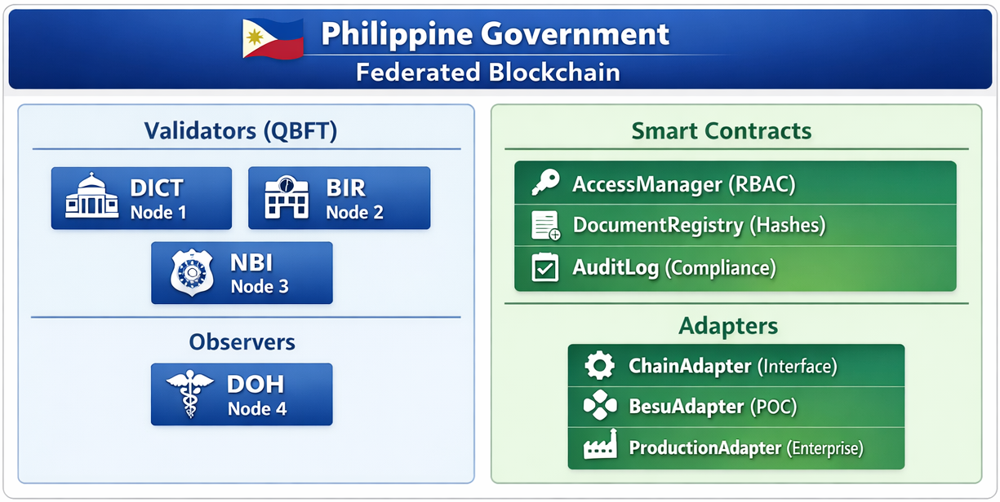

# Philippine Government Federated Blockchain

> **Permissioned Blockchain Network for Inter-Agency Document Registry**

A production-ready Hyperledger Besu QBFT network implementation for Philippine government agencies, enabling secure, auditable document sharing while maintaining compliance with RA 10173 (Data Privacy Act) and DICT guidelines.

## 📋 Overview

This repository provides a complete, modular, and Dockerized blockchain network template designed for:
- **POC Deployment**: Quick setup for agency demonstrations
- **Production Migration**: Clear path to Hyperledger Fabric EVM or Enterprise Besu
- **Compliance**: Built-in support for RA 10173, DICT guidelines, and COA audit requirements

## 🏗️ Architecture



## ✨ Features

### Blockchain Network
- **Consensus**: QBFT (Quorum Byzantine Fault Tolerance)
- **Finality**: Immediate (no forks)
- **Block Time**: 5 seconds
- **Permissioned**: Node and account allowlisting
- **Privacy-Ready**: Tessera/Orion integration template

### Smart Contracts
- **AccessManager**: Role-based access control (ADMIN, AGENCY, AUDITOR)
- **DocumentRegistry**: Immutable document hash storage with access control
- **AuditLog**: Structured audit trail for compliance reporting

### Compliance
- **RA 10173**: No PII stored on-chain (hashes only)
- **DICT Guidelines**: Inter-agency sharing with audit trail
- **COA Requirements**: 10-year audit retention, compliance reports

### Portability
- **Adapter Pattern**: Swap blockchain implementations without code changes
- **Fabric EVM Ready**: Migration template included
- **Enterprise Besu**: Privacy group support template

## 🚀 Quick Start

### Prerequisites

| Software | Version | Install |
|----------|---------|---------|
| Docker | 24.0+ | [docker.com](https://docker.com) |
| Node.js | 18.x+ | [nodejs.org](https://nodejs.org) |
| Git | 2.40+ | [git-scm.com](https://git-scm.com) |

### Installation

```bash
# Clone repository
git clone https://github.com/ph-gov/ph-blockchain-sample.git
cd ph-blockchain-sample

# Install dependencies
npm install

# Copy environment configuration
cp .env.example .env

# Generate node keys and update genesis
chmod +x scripts/network/setup_qbft.sh
./scripts/network/setup_qbft.sh --nodes 3 --observers 1

# Start blockchain network (requires Docker)
cd docker
docker compose up -d

# Deploy smart contracts
cd ..
npm run deploy:besuLocal

# Verify deployment
npm run verify:besuLocal
```

### Access Points

| Service | URL | Credentials |
|---------|-----|-------------|
| JSON-RPC | http://localhost:8545 | - |
| WebSocket | ws://localhost:8546 | - |
| Grafana | http://localhost:8080 | admin / ChangeMe123! |
| Prometheus | http://localhost:9090 | - |

## 📁 Project Structure

```
ph-blockchain-sample/
├── contracts/                 # Smart contracts
│   ├── src/
│   │   ├── AccessManager.sol  # Role-based access control
│   │   ├── DocumentRegistry.sol # Document hash registry
│   │   └── AuditLog.sol       # Audit trail
│   └── artifacts/             # Compiled contracts (gitignored)
│   └── cache/                 # Hardhat cache (gitignored)
├── hardhat.config.ts          # Hardhat configuration (ROOT level)
├── config/besu/               # Besu network configuration
│   ├── genesis_qbft.json      # QBFT genesis file
│   ├── permission-config.toml # Node/account permissioning
│   └── nodes/                 # Node configurations
├── docker/                    # Docker deployment
│   ├── docker-compose.yml     # Network orchestration
│   └── monitoring/            # Prometheus/Grafana
├── scripts/                   # Deployment & utilities
│   ├── deploy/                # Contract deployment
│   ├── network/               # Network setup
│   └── utils/                 # Verification tools
├── src/adapters/              # Blockchain adapters
│   ├── ChainAdapter.ts        # Abstract interface
│   ├── BesuAdapter.ts         # Besu implementation
│   └── ProductionAdapter.template.js # Production template
├── tests/                     # Contract tests
│   ├── AccessManager.test.js
│   ├── DocumentRegistry.test.js
│   └── AuditLog.test.js
├── docs/                      # Documentation
│   ├── architecture.md        # System architecture
│   ├── setup.md              # Setup guide
│   ├── deployment.md          # Deployment guide
│   ├── portability-guide.md   # Migration guide
│   └── compliance.md          # Compliance documentation
├── .env.example               # Environment template
├── package.json               # Dependencies
└── README.md                  # This file
```

## 📖 Documentation

| Document | Description |
|----------|-------------|
| [Architecture](docs/architecture.md) | System design, components, data flow |
| [Setup Guide](docs/setup.md) | Installation and configuration |
| [Deployment](docs/deployment.md) | POC and production deployment |
| [Portability](docs/portability-guide.md) | Migration to Fabric/Enterprise |
| [Compliance](docs/compliance.md) | RA 10173, DICT, COA requirements |
| [Troubleshooting](docs/troubleshooting.md) | Common errors and solutions |

## 🔧 Available Commands

```bash
# Compile contracts
npm run compile

# Run tests
npm run test
npm run test:coverage     # With coverage
npm run test:gas          # With gas report

# Network management
npm run network:start     # Start Docker network
npm run network:stop      # Stop network
npm run network:logs      # View logs
npm run network:reset     # Reset (deletes data!)

# Deployment
npm run deploy:besuLocal      # Deploy to local network
npm run deploy:production     # Deploy to production
npm run verify:besuLocal      # Verify deployment

# Monitoring
npm run monitoring:start  # Start Prometheus/Grafana
```

## 🏛️ Agency Roles

| Role | Agency | Permissions |
|------|--------|-------------|
| ADMIN | DICT | System administration, agency registration |
| AGENCY | BIR, NBI, DOH, etc. | Document registration, access sharing |
| AUDITOR | COA, Ombudsman | Read-only audit access |
| OPERATOR | Network operators | Node operations |

## 🔐 Security Considerations

### Key Management
- **POC**: Private keys in `.env` (never commit!)
- **Production**: Use HSM (AWS KMS, Azure Key Vault, HashiCorp Vault)
- **Rotation**: Implement key rotation policy (quarterly recommended)

### Network Security
- **P2P**: Node permissioning via enode allowlist
- **RPC**: JWT authentication enabled
- **TLS**: Configure for production deployments

### Data Protection
- **On-Chain**: Document hashes only (SHA-256/Keccak-256)
- **Off-Chain**: Original documents in agency storage
- **PII**: NEVER stored on-chain (RA 10173 compliance)

## 📊 Monitoring

### Metrics (Prometheus)
- Block height
- Peer count
- Transaction pool size
- Gas usage
- JVM metrics

### Dashboards (Grafana)
- Network overview
- Validator performance
- Transaction analytics
- Compliance metrics

### Alerts
- Node down
- Consensus issues
- High transaction rejection
- Resource exhaustion

## 🔄 Migration Paths

### To Hyperledger Fabric EVM
1. Implement `FabricAdapter` (template provided)
2. Deploy contracts as EVM chaincode
3. Configure Fabric CA for identity
4. Update application to use Fabric adapter

### To Enterprise Besu
1. Enable Tessera/Orion for privacy
2. Configure CA-based authentication
3. Deploy to Kubernetes (manifests provided)
4. Implement privacy groups for agencies

See [Portability Guide](docs/portability-guide.md) for detailed migration steps.

## 🤝 Contributing

This is a government project. Contributions from Philippine government agencies are welcome.

1. Review compliance requirements
2. Create feature branch
3. Run tests: `npm run test`
4. Submit pull request

## 📄 License

Apache License 2.0 - See [LICENSE](LICENSE) for details.

## 📞 Support

| Contact | Purpose |
|---------|---------|
| blockchain@dict.gov.ph | Technical support |
| compliance@dict.gov.ph | Compliance questions |
| security@dict.gov.ph | Security incidents |

## 🏅 Acknowledgments

- **Hyperledger Besu** - Enterprise Ethereum client
- **OpenZeppelin** - Secure smart contract libraries
- **DICT** - Department of Information and Communications Technology
- **Participating Agencies** - BIR, NBI, DOH, COA

---

*Built for the Philippine Government • Compliance-First • Production-Ready*
